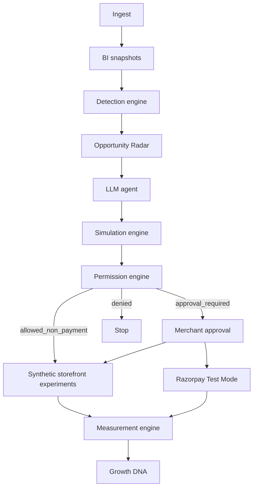

# Vrudhya.ai Architecture

## Purpose

Single modular backend plus one merchant web app. Deterministic systems own facts, detection, permissions, simulation, experiments, measurement, Razorpay I/O, audit, and Growth DNA writes. The LLM reasons over pinned facts and emits structured proposals.

This document does not invent Razorpay APIs. See the adapter allowlist below.

## Process model

Not microservices. One codebase, two process roles:

| Process | Role |
| --- | --- |
| `api` | Merchant HTTP API, webhooks, agent run kickoff |
| `worker` | Same code; jobs via Postgres `FOR UPDATE SKIP LOCKED` |
| Postgres | System of record |

Redis is not required for V1.

Suggested layout: `apps/api` (FastAPI), `apps/web` (Next.js), `docs/`, `scripts/`.

## Module boundaries

```text
ingest        → canonical storefront events + payment events
bi            → FactSnapshots (observations)
detect        → opportunities (Radar)
agent         → LLM loop, tools, pin set
simulate      → labelled simulation numbers
permissions   → allow / approval_required / denied + kill switch
experiments   → assignment, lifecycle, measurement
razorpay      → Test Mode client + webhooks only
memory        → Growth DNA writes (gated)
audit         → append-only
```

The LLM is not a module that owns data. It is a caller of tools.

## Control flow



Payment writes never take the `allowed` (autonomous) path in V1.

## Deterministic vs LLM

| Concern | Owner |
| --- | --- |
| Metrics, funnels, payment aggregates | `bi` |
| Opportunity creation and scoring | `detect` |
| Fact pin list on a run | `agent` runtime (code) |
| Diagnosis, hypotheses, intervention text | LLM structured output |
| Assumption bounds and impact math | `simulate` |
| Permission, kill switch, deny lists | `permissions` |
| Control/variant assignment | synthetic storefront + `experiments` |
| Razorpay HTTP and webhook verify | `razorpay` |
| Incrementality and hypothesis `supported` / `rejected` / `inconclusive` | `experiments` measurement |
| DNA inserts | `memory` after measurement or merchant edit |

## Data adapters

**Storefront analytics (V1):** `SyntheticLumiStorefront`. Emits PDP views, sessions, assignment, orders at the funnel. Future: Shopify or equivalent implementing the same event grain.

**Payments:** `RazorpayTestAdapter` or `SyntheticPaymentsAdapter` for local dev without keys. Same interface.

Razorpay must not be used to compute storefront conversion.

## Razorpay Test Mode (V1)

- Keys must be `rzp_test_`. Live keys are a startup/config failure unless a future flag exists; V1 has no such flag.
- Base URL: `https://api.razorpay.com/v1`
- Auth: HTTP Basic (key id + secret), server-side only
- Webhooks: verify `X-Razorpay-Signature` HMAC-SHA256 over the **raw** body; idempotent upsert by Razorpay event id

**Allowlisted operations:**

- `GET /v1/payments`, `GET /v1/payments/:id`
- `GET /v1/orders`, `POST /v1/orders` only when required to attach a **pre-existing** Dashboard `offer_id` via documented `offers` array
- `POST /v1/payment_links`, `GET /v1/payment_links`, documented cancel
- Webhook events: `payment.captured`, `payment.failed`, `order.paid`, `payment_link.paid`, `payment_link.expired`, `payment_link.cancelled`

**Not allowed:**

- Live mode
- refunds
- captures
- creating Offers via API (Dashboard-only; store `offer_id` as merchant config/DNA `asset`)
- arbitrary URLs or payloads
- using payments API as traffic analytics

Test Mode Payment Link creation limits (Razorpay: 30 links per business in test) must be enforced in the experiment engine.

Every Razorpay write: merchant approval + permission engine + audit + idempotency key.

## Permission engine

Inputs: authenticated `merchant_id`, `action_type`, payload schema, limits, kill-switch flags, experiment state.

Hard denies (V1): refunds, captures, live mode, arbitrary HTTP, unallowlisted `action_type`.

Payment-related writes: never `allowed`; at best `approval_required`.

Kill switch on: no autonomous execute.

## Agent runtime

- Load opportunity (must already exist)
- Pin FactSnapshots
- LLM steps with structured schemas
- Deterministic critic: unknown fact ids, missing claim types, illegal `action_type`, impact numbers in LLM output
- Tools do not take `merchant_id`

State includes `awaiting_approval`. Approval is a merchant API, not a chat vote.

## Frontend

Next.js app talks only to the API. No Razorpay secrets in the browser.

Routes map to product areas (Radar, opportunity workspace, Lab, Impact, DNA, Permissions including kill switch, Audit).

UI must render claim-type labels. Growth Preview is simulation-only.

## Security (architecture)

- Tenant filter in the data layer using auth context
- Webhook signature verification
- PII in payment payloads redacted before any LLM tool result
- Append-only audit
- Secrets in environment only

## Deployment

Docker Compose: `web`, `api`, `worker`, `postgres`. One host for V1 (e.g. Fly or Railway). Alembic migrations on deploy.

## Related documents

- [PRODUCT_SPEC.md](PRODUCT_SPEC.md)
- [AGENT_SPEC.md](AGENT_SPEC.md)
- [DATA_MODEL.md](DATA_MODEL.md)
- [EVALUATION.md](EVALUATION.md)
